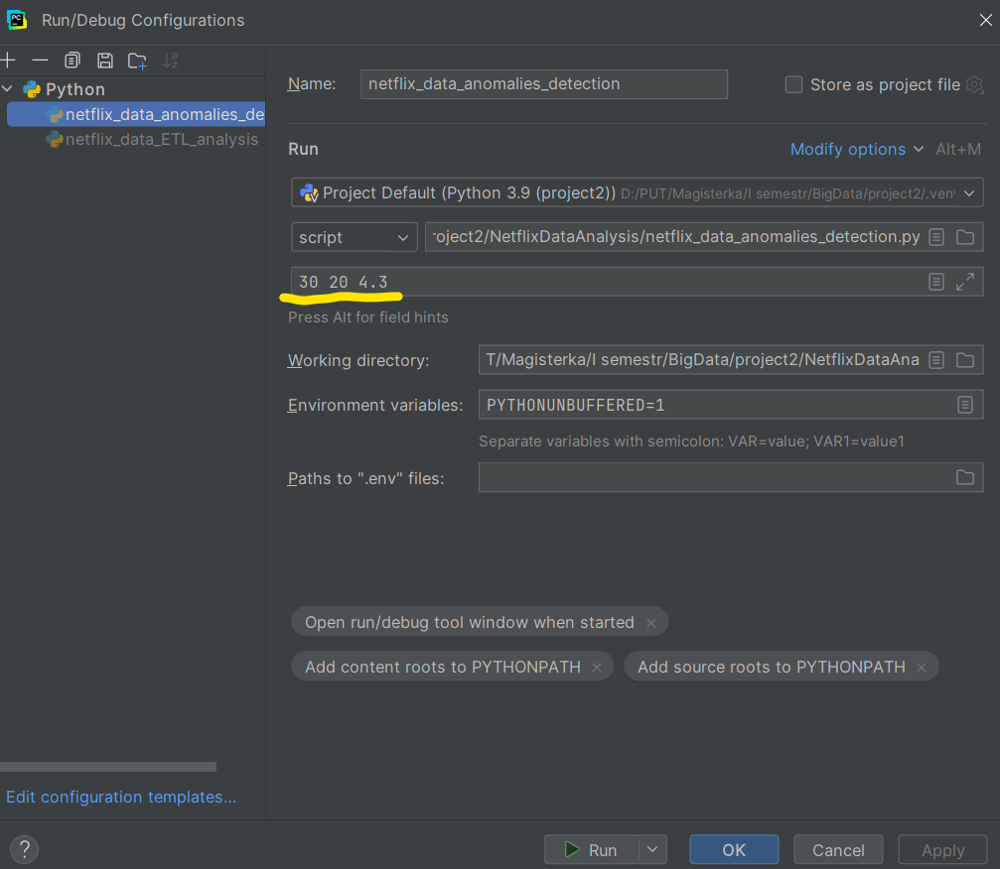
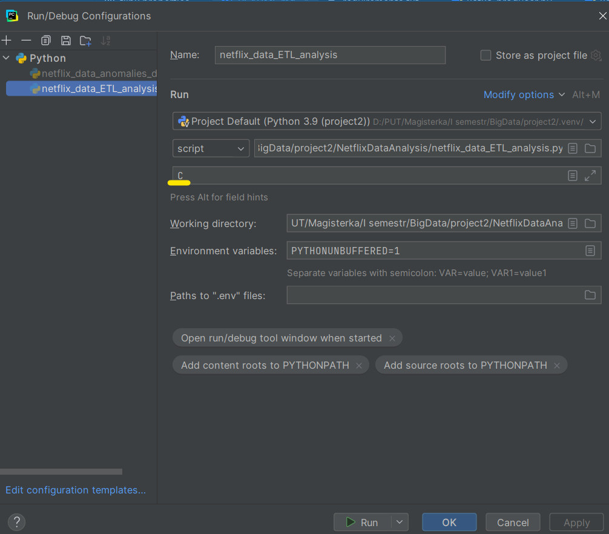

# BigData - project2
**Platforma: Flink (DataStream API)**

**Zestaw 1 – Netflix-Prize-Data**

## Instrukcja uruchamiania projektu:
### Przygotowania:
- pobierz dane dla zestawu 1 [movie_titles.csv](https://www.cs.put.poznan.pl/kjankiewicz/bigdata/stream_project/movie_titles.csv) oraz [netflix-prize-data](https://www.cs.put.poznan.pl/kjankiewicz/bigdata/stream_project/netflix-prize-data.zip) i umieść je w folderze `data`
- zainstaluj potrzebne biblioteki, w szczególności: `pip install kafka-python` oraz `pip install apache-flink`
- w celu zainstalowania wszystkich wymaganych pakietów możesz skorzystać z przygotowanego pliku `requirements.txt`

- podczas uruchamiania projektu korzystaj z kontenerów `FlinkAndFriends2025`, upewnij się, że wskazany parametr ma poprawną wartość w pliku `docker-compose.yml`:
``` bash
KAFKA_ADVERTISED_LISTENERS: PLAINTEXT://localhost:9092
```
```bash
docker compose -p fandf up -d
```
- utwórz temat producenta w kontenerze Kafki:
 ``` bash
docker exec -it fandf-kafka-1 /bin/bash
```
```bash
/opt/kafka/bin/kafka-topics.sh --create --bootstrap-server kafka:9092 \
 --replication-factor 1 --partitions 3 --topic netflix
```
- ustaw wartości poszczególnych parametrów skryptu `kafka-producer.py` zgodnie ze swoją konfiguracją:
```
CSV_FOLDER = 'data\\netflix-prize-data'
KAFKA_BOOTSTRAP_SERVERS = 'localhost:9092'
KAFKA_TOPIC = 'netflix'
```
- uruchom skrypt `kafka_producer.py` i obserwuj temat producenta, czy został zasilony
```bash
/opt/kafka/bin/kafka-console-consumer.sh --bootstrap-server localhost:9092 --topic netflix --from-beginning
```
Spodziewany format wiadomości w temacie:
```
2000-01-29,7397,1428659,3
2000-01-29,7397,562156,3
2000-01-29,7397,417988,4
```
### Wykrywanie anomalii:
- utwórz temat, do którego trafią wykryte anomalie:
 ``` bash
/opt/kafka/bin/kafka-topics.sh --create --bootstrap-server kafka:9092 \
 --replication-factor 1 --partitions 3 --topic netflix-anomalies
```
- pobierz potrzebne pliki `.jar` zgodnie z tutorialem do laboratoriów z Flinka, zwróć uwagę na plik `flink.properties` i dostosuj poszczególne propsy, w szczególności zwróć uwagę na: `static.file.path` oraz `pipeline.jars` 
- uruchom skrypt `netflix_data_anomalies_detection.py` wraz z wybranymi parametrami D, L oraz O podanymi w run configuration IDE

- po chwili uruchom skrypt konsumenta z tematu odbiorczego kafki `kafka_consumer.py` i obserwuj wyniki, upewniając się wcześniej czy ma on poprawne parametry:
```bash
KAFKA_BOOTSTRAP_SERVERS = 'localhost:9092'
KAFKA_TOPIC = 'netflix-anomalies'
```
Przykładowa część wyniku dla parametrów `D:30 L:20 O:4.3`:
```
Nasłuchiwanie wiadomości z tematu: netflix-anomalies
Odebrano: {"window_start": "1999-12-09T01:00:00", "window_end": "2000-01-08T01:00:00", "title": "Apollo 13", "count": 20, "avg_rate": 4.35}
Odebrano: {"window_start": "1999-12-10T01:00:00", "window_end": "2000-01-09T01:00:00", "title": "Die Hard", "count": 25, "avg_rate": 4.32}
Odebrano: {"window_start": "1999-12-10T01:00:00", "window_end": "2000-01-09T01:00:00", "title": "The Matrix", "count": 32, "avg_rate": 4.3125}
Odebrano: {"window_start": "1999-12-11T01:00:00", "window_end": "2000-01-10T01:00:00", "title": "October Sky", "count": 22, "avg_rate": 4.363636363636363}
Odebrano: {"window_start": "1999-12-11T01:00:00", "window_end": "2000-01-10T01:00:00", "title": "The Terminator", "count": 20, "avg_rate": 4.35}
```

### ETL – obraz czasu rzeczywistego:
- utwórz kontener MongoDB:
```dockerfile
docker run -d -p 27017:27017 --name mongodb mongo
```
- sprawdź parametry dotyczące MongoDB w pliku `flink.properties`
- uruchom skrypt `netflix_data_ETL_analysis.py` z wybranym parametrem delay (wartość A lub C) podanym w run configuration IDE

- po chwili uruchom skrypt `mongodb_reader.py` i sprawdź wyniki w kolekcji MongoDB

Przykładowy fragment wyniku dla trybu `A`:
```json
{"_id": "683ad97fbffce212c887074d", "id": 4883, "title": "The Bodyguard", "month": "1999-12", "count_rate": 26, "sum_rate": 72.0, "unique_users": 26}
{"_id": "683ad97fbffce212c887074f", "id": 4883, "title": "The Bodyguard", "month": "1999-12", "count_rate": 27, "sum_rate": 76.0, "unique_users": 27}
{"_id": "683ad97fbffce212c8870751", "id": 4883, "title": "The Bodyguard", "month": "1999-12", "count_rate": 28, "sum_rate": 81.0, "unique_users": 28}
```
Przykładowy fragment wyniku dla trybu `C`:
```json
{"_id": "683ada53a0d9acc9c30e23f5", "id": 15940, "title": "Box of Moonlight", "month": "1999-12", "count_rate": 4, "sum_rate": 17.0, "unique_users": 4}
{"_id": "683ada53a0d9acc9c30e23f7", "id": 9654, "title": "Very Bad Things", "month": "1999-12", "count_rate": 18, "sum_rate": 39.0, "unique_users": 18}
{"_id": "683ada53a0d9acc9c30e23f9", "id": 13787, "title": "Powder", "month": "1999-12", "count_rate": 29, "sum_rate": 97.0, "unique_users": 29}
```

### Restart środowiska:
- usuń tematy Kafki
- wykonaj skrypt `mongodb_restart.py`, aby usunąć kolekcję w MongoDB
